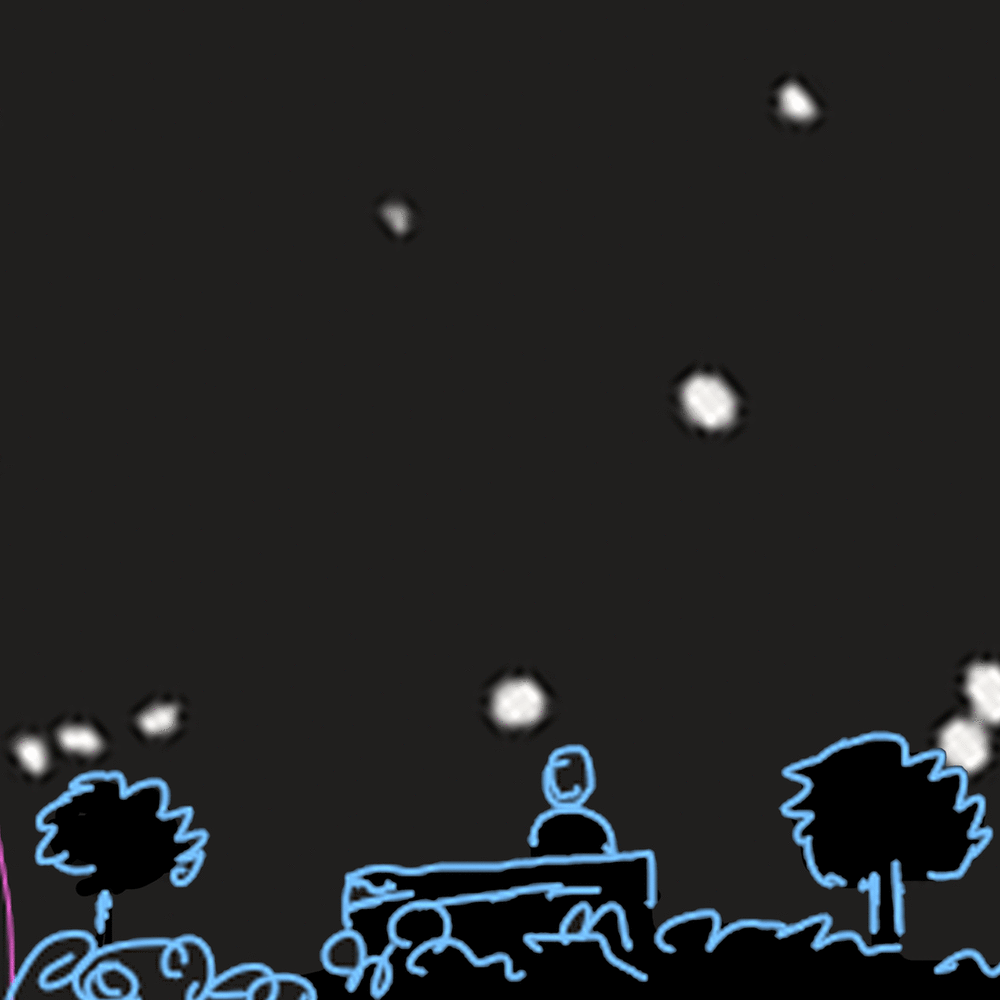
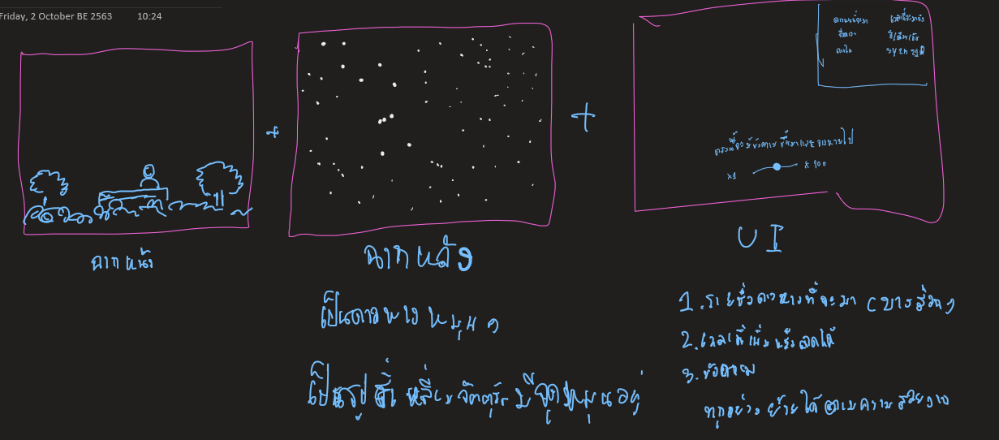

# ดาวหางวิ้บวั้บจุ้กกรู้
* [เกี่ยวกับ](#เกี่ยวกับ)
* [ฟังชั่นก์การทำงาน](#ฟังชั่นก์การทำงาน)
* [สิ่งที่ต้องทำ](#สิ่งที่ต้องทำ)
* [Ref](#Ref)

## เกี่ยวกับ
การจำลองการนั่งรอดูดาวหางที่งดงามด้วยคอนเซ็ปต์ที่ว่า "ระยะเวลาที่นั่งรอดูดาวอาจจะยาวนานเป็น 100 ปีเเละเราสามารถเร่งเวลาเพื่อ ไปดูดาวหางที่หวังได้เเต่ถ้าเร่งเวลาจนเลยดาวหางที่อยากดูไป ก็ไมสามารถ หยุด หรือยอนเวลาได้ ทำได้เพียงเเค่รอให้มันกลับหาอีกครั้งหนึ่ง"

## ฟังชั่นก์การทำงาน
*  ระบบเวลา
	* ดึงเวลาจริงใช้
	* เร่ง/ลด ความเร็วของเวลา
* ดาวหาง
	* ช่วงที่ได้เห็นดาวหาง
	* ระยะเวลาที่ต้องรอ
## สิ่งที่ต้องทำ
* เวลา
	* [X] ลูปเวลา
		* [X] เร่ง/ลด ความเร็วของเวลา
	* [ ] ดึงเวลาจริงใช้
* ดาวหาง
	* [ ] รายชิ่อดาวหางที่กำลังมาถึง
		* [ ] ข้อมูลดาวหางที่จะใข้
			* ชิ่อ
			* มาตอนไหน
			* ใช้เวลาโคจรเท่าไร
	* [ ] ดาวหางตอนกำลังตก
		* [ ] รูปดาวหาง
		* [ ] ทิศทาง
		* [ ] เวลาที่ใช้ตก
* UI
	* [ ] ฉากหน้า
	* [ ] ฉากหลัง
	* [ ] ปุ่มต่างๆ
	* [ ] เเทบเเสดงรายชิ่อดาวหาง
## Ref

